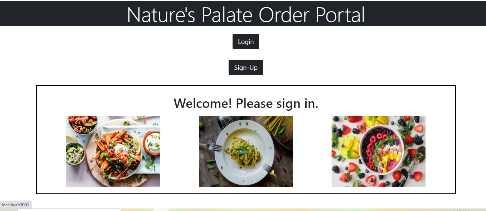

# Natures Palate

  ## Description
 My motivation behind this project was to make it easy for restaurant employees to manage orders and menus in an efficient and effective way. I wanted to streamline the process and eliminate any unnecessary steps or confusion

  ## Github Repo link: 
  https://github.com/crissyg923/natures-palate

  ## Heroku Link
  https://mysterious-hollows-20984-6a9045bbe22a.herokuapp.com/

  ## Picture of App
  
  

  ## Table of Content

  - [Installation](#installation)
  - [Usage](#usage)
  - [Contribution Details](#contribution-details)
  - [Test Instructions](#test-instructions) 
  - [License](#licenses)
  - [Contact](#contact)
  
  

  ## Installation: 
    Express, MySQL and Sequelize, Insomnia, Jimp

  ## Usage:
  to manage resturant's employee, menu and order with authentication

  ## Contribution Details: 
    Crystal Green, Lina Errico, Neha Sabannavar, Rutger's TAs and tutors.

  ## Test Instructions: 
   Command to run the script : 
   - npm i (to install)
   - create the database by running schema file: source db/schema.sql 
   - npm run seed (to seed the data)
   - npm start (to start the application)

  ## Licenses: 
  MIT
      
  https://opensource.org/licenses/MIT 

  
  ## Contact: 
  Below mentioned are the github profile link of 3 main contributors 
  
  ## Crystal Green: https://github.com/crissyg923
  ## Lina Errico: https://github.com/LMErrico
  ## Neha Sabannavar: https://github.com/Nehaps29
  

  